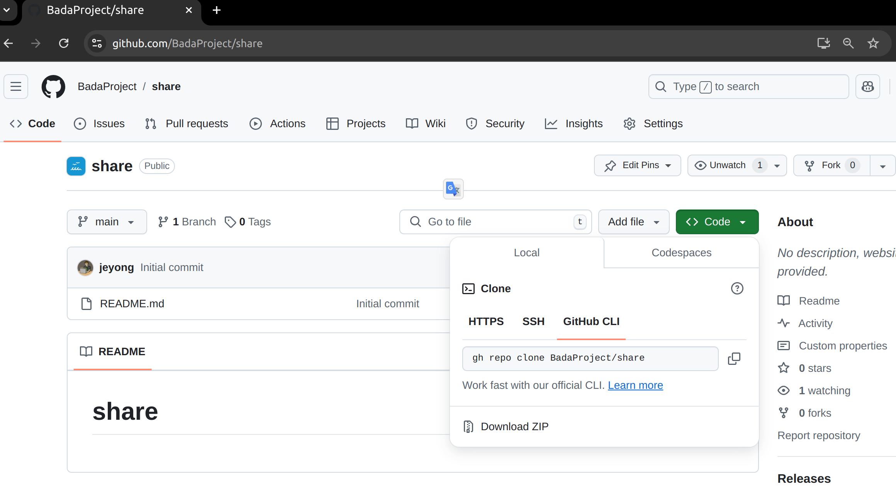

# 실행 방법
## 다운받기
* 녹색의 'Code' 버튼을 누르면 'Download Zip' 버튼이 생성되며 이 버튼을 누르면 소스코드 전체를 다운받을 수 있다.
* 다운받은 후 원하는 위치에 압축을 푼다.


## 연결하기
* 노트북을 PLC가 연결된 네트워크에 이더넷 케이블로 연결하기
* IP 주소 확인하기
   * PLC의 IP 주소 확인하여 기록하기
   * 노트북의 IP 주소 확인하여 기록하기

## PX4Emul.py에서 설정하기
* PLC IP 주소, port 수정
```python
def __init__(self, plc_ip='127.0.0.1', plc_port=2005, px4_listen_port=2006):
        self.px4_listen_port = px4_listen_port
        self.plc_ip = plc_ip
        self.plc_port = plc_port
        self.sock = socket.socket(socket.AF_INET, socket.SOCK_DGRAM)
        self.plc_packet = PLCPacket()
        self.isWriteCommand = False
```
* plc_ip와 plc_port를 수정하기
* px4_listen_port를 현재 2006 으로 설정하였으며 필요에 따라 변경한다

## 동작 설명
* PX4Emul은 PLC와 UDP 통신을 수행한다.
* PX4는 0.5초마다 Write 및 Read_Request를 명령을 전송한다.
 
## 실행하기
* 윈도우에서 명령 프롬포트 열기
* 명령 프롬포트 내에서 다운받은 src 디렉토리로 이동
* 명령 프롬포트 내에서 아래와 같이 명령 실행

```bash
> python PX4Emul.py
```

## PLC에서 확인
* PX4 -> PLC로 전송하는 Write 명령이 제대로 실행되는지 확인한다.
* PX4 -> PLC로 전송하는 Read Request 명령이 제대로 실행되는지 확인한다.
* PX4 -> PLC로 Reqad Request를 수신하면 이에 따라 PLC -> PX4로 해당 주소의 값을 제대로 전송하는지 확인한다.
